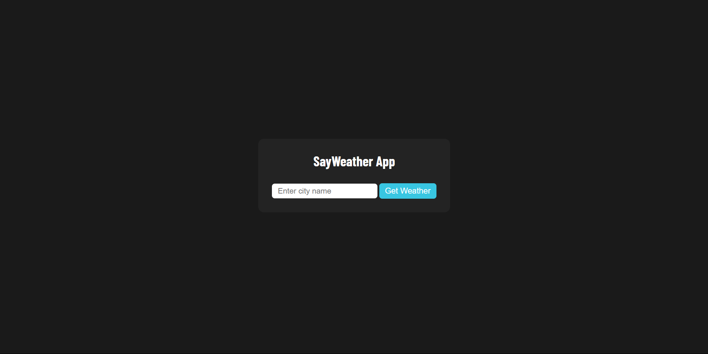
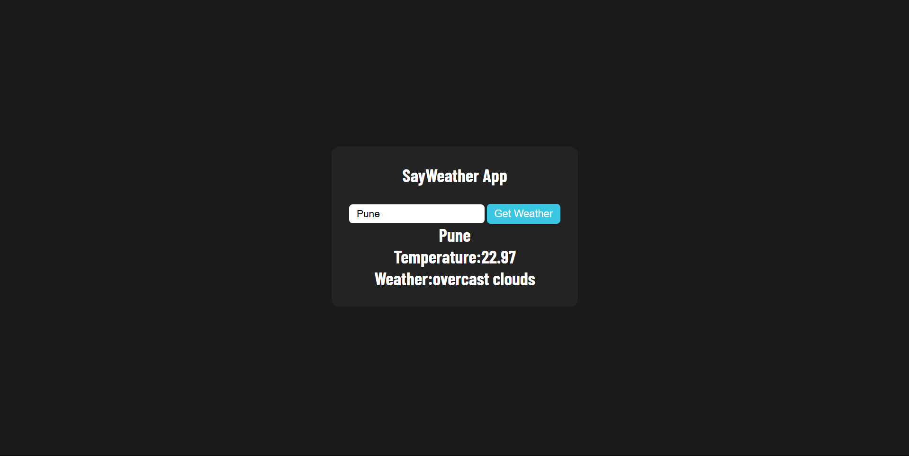
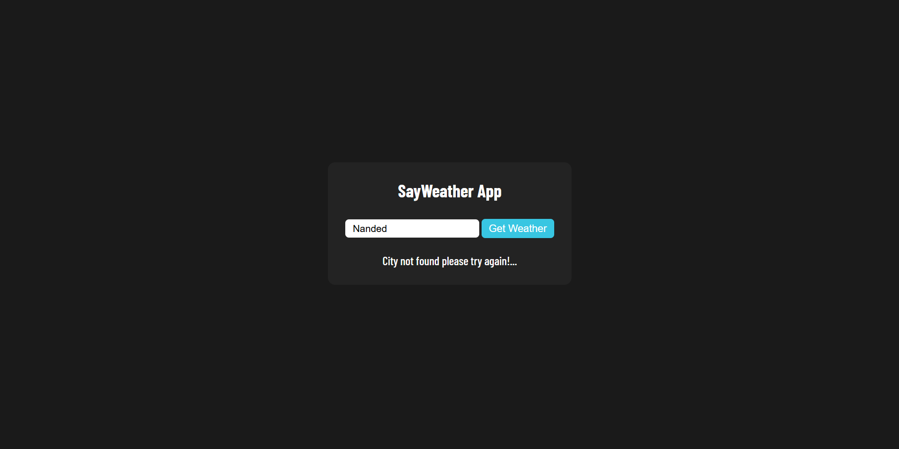

# 🌦️ Weather App  

A simple and interactive Weather App built using HTML, CSS, and JavaScript. The app fetches and displays real-time weather information for any city using the [OpenWeather API](https://openweathermap.org/api).  

---

## 📖 Features  
- Search for current weather conditions by city name.  
- Displays:  
  - Current temperature.  
  - Weather description (e.g., sunny, rainy, cloudy).  
  - Humidity and wind speed.  
- Responsive design for various devices.  
- Persistent and user-friendly interface.  

---

## 🛠️ Technologies Used  
- **HTML**: Structure of the application.  
- **CSS**: Styling the app with a clean and modern layout.  
- **JavaScript**: Core functionality and dynamic updates.  
- **Fetch API**: For making API requests to the OpenWeather API.  

---

## 🎯 How It Works  

1. **Search for a City**:  
   Enter the name of a city in the input field and click "Search" or press "Enter".  
     

2. **Display Weather Details**:  
   Once the city is found, the app displays:  
   - Current temperature in Celsius or Fahrenheit.  
   - Weather description and an icon representing the condition.  
   - Humidity and wind speed.  
     

3. **Error Handling**:  
   If the city is not found or there's a network error, an error message is displayed.  
     

---

## ⚙️ Installation and Usage  

1. Clone the repository to your local machine:  
   ```bash
   git clone https://github.com/your-username/weather-app.git
